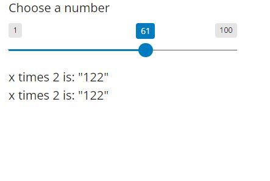

# Learning Shiny Express

My first website using Markdown and GitHub Pages.

## Links

- Tutorial: (https://shiny.posit.co/py/docs/overview.html)
- Playground examples: (https://shinylive.io/py/examples/)
- Helpful AI assistant for learning: (https://chat.openai.com/)

## Images

Image of reactive Shiny application found in the Playground:

